# FlavorFiesta     
Food recipe mobile app built with React Native that blends functionality, style, and convenience to make the cooking journey enjoyable for users of all levels

## Demo

| Welcome Screen | Home Screen | Recipes Screen |
| --- | --- | --- |
| 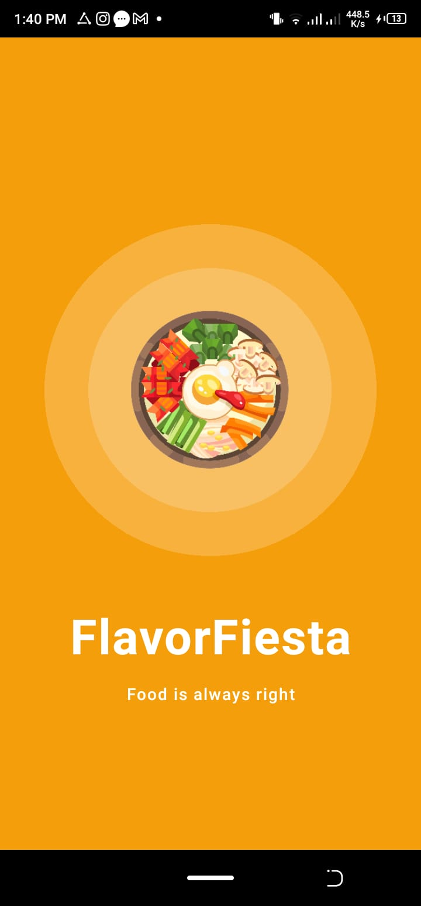 | 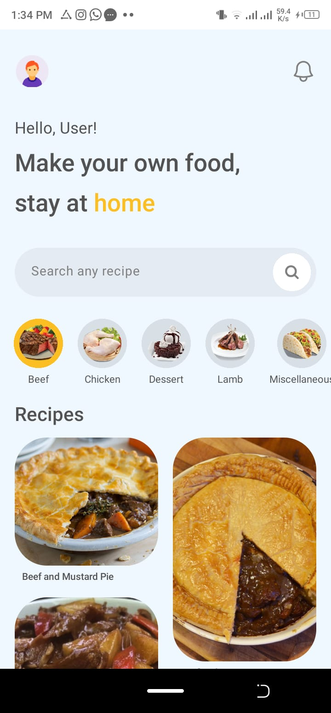 | 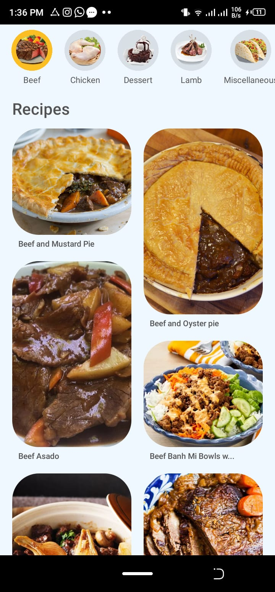 |

| Recipe Images | Image & Instructions | Instructions |
| --- | --- | --- |
| 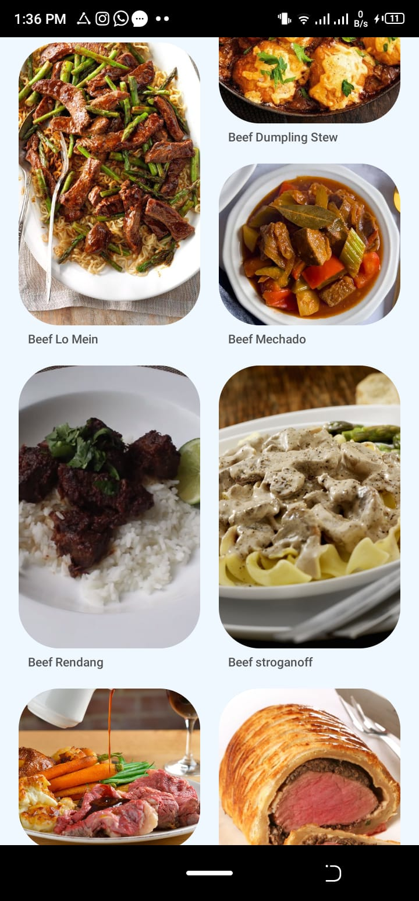 | 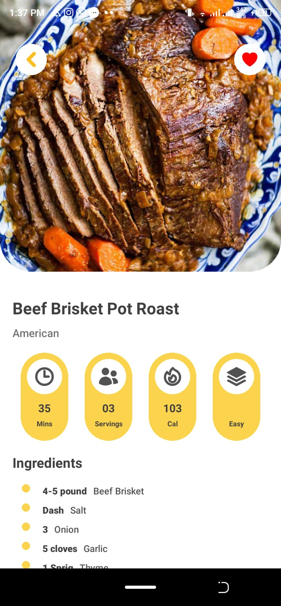 | 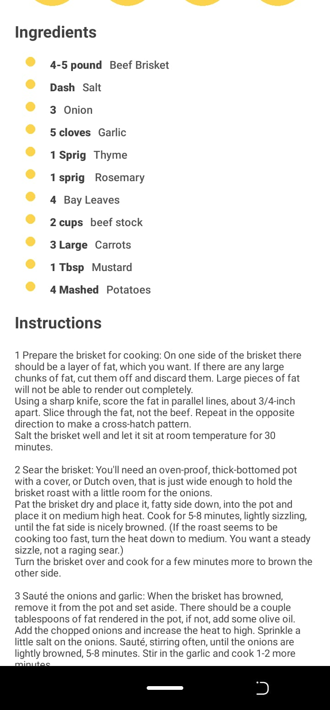 |

| Instructions & Video | Search Feature | Not Found Screen |
| --- | --- | --- |
| 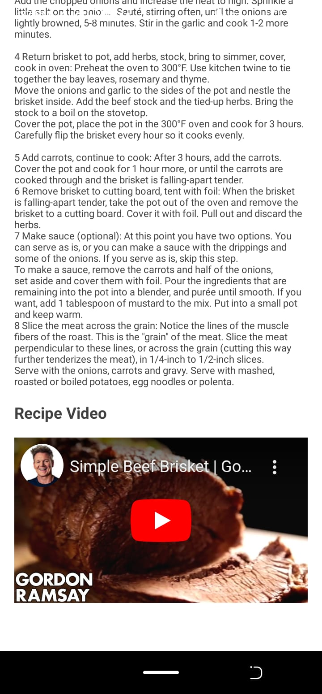 | 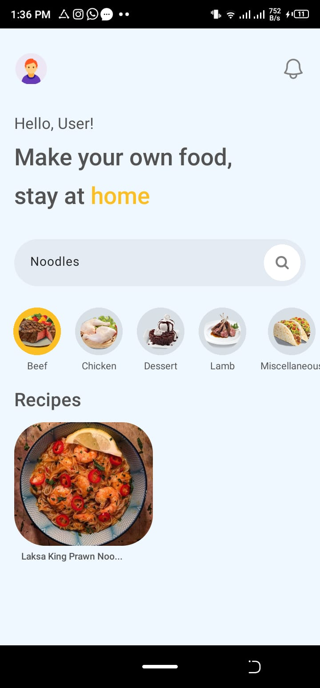 | 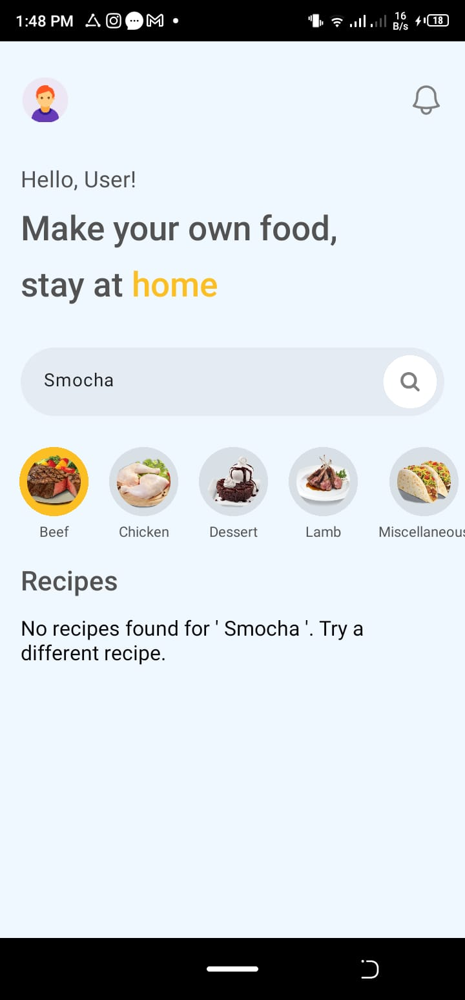 |

## Usage

To experience a live preview of FlavorFiesta, follow these steps:

1. Download and install the [Expo Go](https://expo.dev/client) app on your Android or iOS device.

2. Open Expo Go and scan the QR code corresponding to your device:

   | Android | iOS |
   | --- | --- |
   | 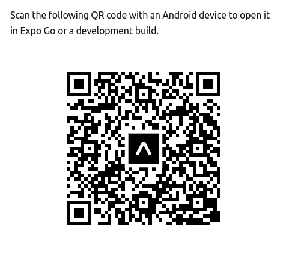 | 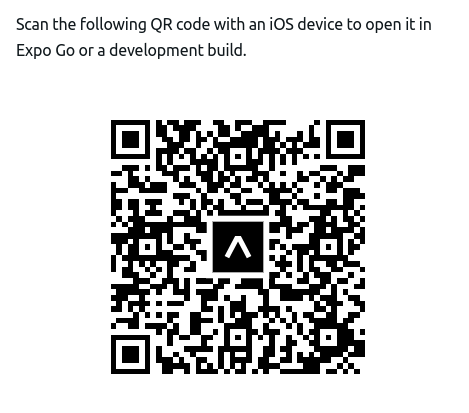 |

3. Enjoy exploring FlavorFiesta in the Expo Go app!

## License

This project is licensed under the MIT License - see the [LICENSE](LICENSE) file for details.

